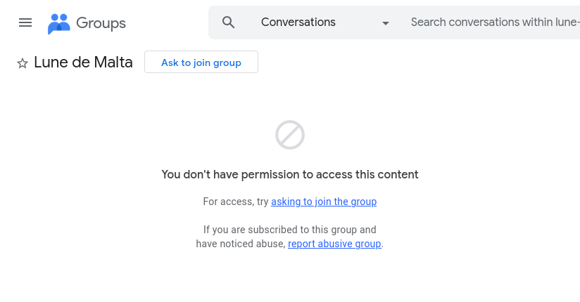
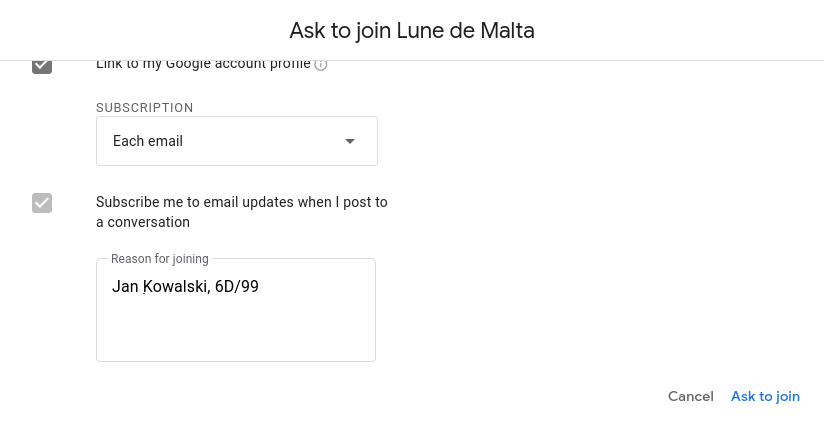

Title: Kanały komunikacji
Date: 2025-09-18 15:00
Category: Proces
Slug: kanaly-komunikacji
Author: Tomasz Maćkowiak
Summary: Opis kanałów komunikacji między właścicielami mieszkań.

Właściciele na pierwszym nieformalnym zebraniu wyrazili potrzebę alternatywnego mechanizmu komunikacji do Facebooka.
W odpowiedzi na to utworzyłem:

* [stronę internetową lunedemalta.pl](https://lunedemalta.pl), na której będą publikowane wpisy dotyczące procesu zmiany formy zarządu,
* [listę mailingową na Google Groups](https://groups.google.com/g/lune-de-malta), gdzie każdy zainteresowany może się zapisać i otrzymywać kopie wiadomości bezpośrednio na swoją skrzynkę email,
* [dedykowany adres email](mailto:tomasz.mackowiak@lunedemalta.pl) do kontaktu ze mną na temat zmiany formy zarządu.

Zachęcam do zapisywania się na listę mailingową:

1. Wejdź na [https://groups.google.com/g/lune-de-malta](https://groups.google.com/g/lune-de-malta)
1. Pokaże się informacja o tym, że nie masz uprawnień do przeglądania treści, to spodziewane.

    

    * Jeśli jesteś zalogowany na swoje konto Google to świetnie.
    * Jeśli nie jesteś zalogowany na swoje konto Google, to najpierw się zaloguj.
    * Jeśli nie masz konta Google, to możesz utworzyć konto z wykorzystaniem dowolnego adresu email.
    
1. Wybierz przycisk "Poproś o dołączenie do grupy".
1. W treści prośby proszę podać swoje **imię i nazwisko** oraz **klatkę i numer mieszkania**, aby można było zweryfikować, że jesteś właścicielem mieszkania na osiedlu. Przykładowo: "Jan Kowalski, 6D/99".
1. Wyślij prośbę. Zostanie ona przeze mnie zweryfikowana i zaakceptowana możliwe jak najszybciej.

Obiecuję, że ta lista mailingowa będzie wykorzystywana wyłącznie do komunikacji dotyczącej procesu zmiany formy zarządu nieruchomością wspólną. Komunikacja będzie miała charakter jednostronny - ja będę wysyłać wiadomości do zarejestrowanych właścicieli, ale nie będzie możliwości wysyłania wiadomości ani odpowiedzi przez pozostałych członków do całej grupy. W ten sposób unikniemy spamu i niepotrzebnych dyskusji na liście mailingowej.

Jeśli chcesz zostać jednym z **reprezentantów współwłaścicieli** i kandydować do zarządu, [daj mi znać mailowo](mailto:tomasz.mackowiak@lunedemalta.pl).

Jeśli chcesz pomóc przy **zbieraniu podpisów**, to również [daj mi znać mailowo](mailto:tomasz.mackowiak@lunedemalta.pl).

