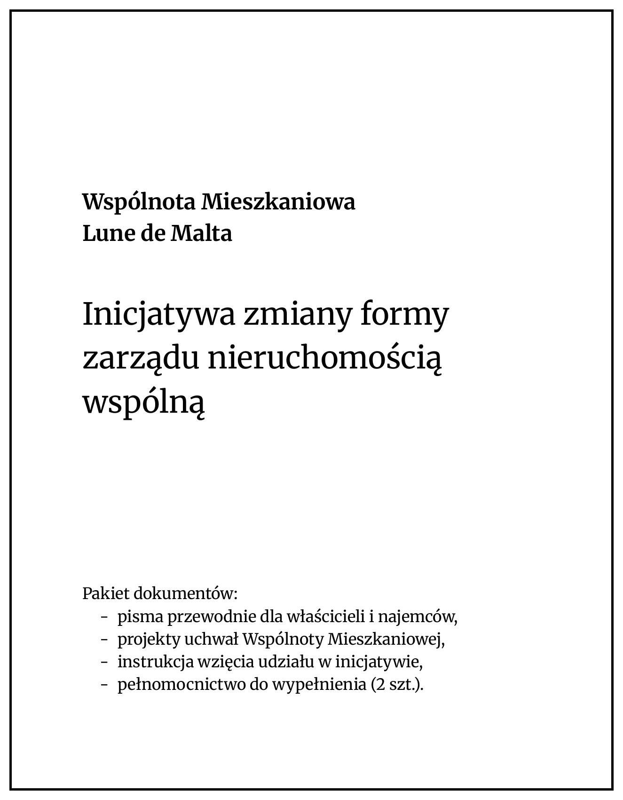

Title: Pakiet dokumentów
Date: 2026-01-31 12:00
Category: Proces
Slug: pakiet-dokumentow
Author: Tomasz Maćkowiak
Summary: Informacja o dostarczeniu pakietu dokumentów dotyczących zmiany formy zarządu nieruchomością wspólną do skrzynek pocztowych.

W dniu dzisiejszym, tj. 31 stycznia 2026 roku, do skrzynek pocztowych wszystkich mieszkań na osiedlu Lune de Malta **został dostarczony pakiet dokumentów** dotyczących zmiany formy zarządu nieruchomością wspólną.

Pakiet ten zawiera następujące dokumenty:

* list przewodni dla właścicieli mieszkań wyjaśniający cel i proces zmiany formy zarządu,
* list przewodni dla najemców, nakłaniający do przekazania dokumentów właścicielom mieszkań,
* pełnomocnictwo do reprezentowania udziałów na zebraniu formalnym, do podpisu przez właściciela lub właścicieli mieszkania,
* projekty uchwał, które będą poddane pod głosowanie na zebraniu formalnym:

    * projekt uchwały o zmianie formy zarządu na zarząd właścicielski,
    * projekt uchwały o wyborze członków zarządu właścicielskiego,

* instrukcja postępowania.

Zachęcam do zapoznania się z dokumentami oraz **podpisania i oddania załączonego tam pełnomocnictwa**, które umożliwi reprezentowanie Państwa udziałów na zebraniu formalnym i skuteczne przeprowadzenie głosowania nad zmianą formy zarządu.