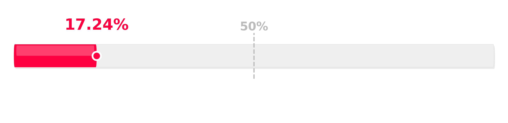

Title: Postęp zbierania pełnomocnictw - kwiecień 2026
Date: 2026-04-26 12:00
Category: Progres
Slug: status-kwiecien
Author: Tomasz Maćkowiak
Summary: Kwietniowa aktualizacja dotycząca postępu zbierania pełnomocnictw.

Na dzień dzisiejszy, tj. 26. kwietnia 2026 roku, zebraliśmy już pełnomocnictwa reprezentujące **17.24%** udziałów w nieruchomości wspólnej. Naszym celem jest osiągnięcie powyżej 50% udziałów.

Bardzo dziękujemy wszystkim właścicielom mieszkań, którzy poparli inicjatywę i już dostarczyli podpisane pełnomocnictwa!

Zachęcamy pozostałych właścicieli do **włączenia się w inicjatywę** poprzez podpisanie i oddanie pełnomocnictwa, które zostało dostarczone do Państwa skrzynek pocztowych z pakietem dokumentów w dniu 31. stycznia 2026. Każde pełnomocnictwo jest ważne i posuwa naszą wspólną sprawę do przodu.

